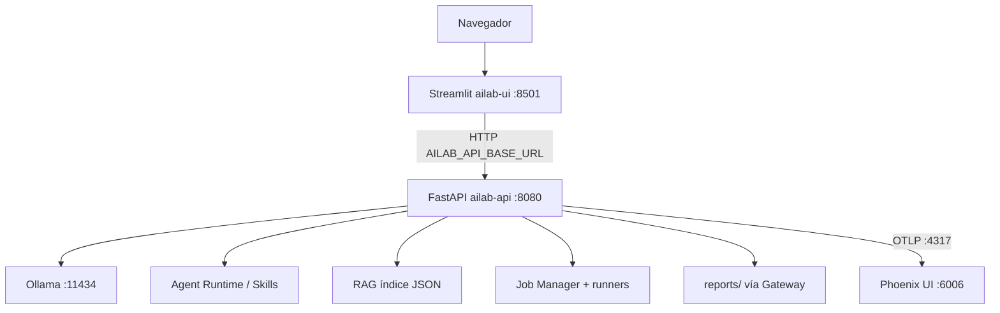

# CLAUDE.md — Guía operativa para agentes

Manual principal para continuar el trabajo en **`ai-testing-lab`**.
Escrito para una sesión nueva: qué es el proyecto, qué está hecho, qué falta,
qué no se debe romper y cuál es el siguiente paso exacto.

> Complementa (no reemplaza) `README.md`, `docs/architecture.md` y
> `docs/security-notes.md`. Ante conflicto de detalle de diseño, priorizar
> el código y los contratos OpenAPI del Gateway.

---

## Resumen ejecutivo

| Aspecto | Estado |
|---|---|
| Qué es | Laboratorio local de AI Engineering / LLMOps (Fase 1) |
| Qué no es | Solo un chatbot; no entrena modelos desde cero en Fase 1; no es multi-cloud aún |
| Arquitectura | Navegador → Streamlit → FastAPI Gateway → Ollama / Skills / RAG / Evals / Reports → Phoenix |
| UI operativa | Inicio, Chat, Skills, RAG, Evaluaciones |
| UI pendiente | Reportes, Observabilidad (UI-1F), Arquitectura visual (UI-1G), cierre UI-1H |
| HEAD versionado | `773c31a` — `feat(local-ui): add controlled RAG interface` |
| Working tree | Contiene **UI-1E sin commit** (cambios locales + `ui/evals_payload.py` untracked) |
| Runtime evals | **Degradado** (Promptfoo/garak ausentes; venv/pip frágil en imagen API) |
| Baseline tests | API **38** · UI **95** (durante UI-1E) |
| Fase 2 | Solo diseño en `infra/future/` y `docs/phase-2-multicloud.md` — **no iniciada** |

**Conclusión actual:** UI-1E funcional como interfaz; runtime de evaluaciones
parcialmente degradado. No declarar el subsistema de evals como plenamente
operativo.

---

## Próxima sesión — empezar aquí

Orden **obligatorio**:

1. Revisar los cambios locales de **UI-1E** (`git status`, `git diff`).
2. Ejecutar tests completos (API + UI) dentro de los contenedores.
3. Prueba manual de la vista **Evaluaciones** en `http://127.0.0.1:8501`.
4. Crear **commit de checkpoint de UI-1E** (solo cuando el usuario lo autorice).
5. Confirmar working tree limpio.
6. Iniciar **EVAL-RUNTIME-1** (etapa independiente; ver abajo).

### EVAL-RUNTIME-1 (después del commit de UI-1E)

Etapa para reparar el runtime de evaluaciones **dentro de Docker**, sin mezclar
con UI-1F:

- Reparar **DeepEval** en la imagen / flujo Docker.
- Reparar **Ragas** en la imagen / flujo Docker.
- Decidir cómo integrar **Node.js/npx** y **Promptfoo** (autorización explícita).
- Decidir si instalar **garak** (autorización explícita).
- Directorios temporales **separados por job** (evitar race en `/tmp/ailab_run`).
- Reportes consistentes para **Security** (`report_ref` cuando aplique).
- Revalidar **Run All**.
- No depender de venvs creados en Windows; evitar venvs frágiles en runtime
  si pueden prepararse en **build**.

### Después de EVAL-RUNTIME-1

1. **UI-1F** — Reportes y Observabilidad.
2. **UI-1G** — Arquitectura visual.
3. **UI-1H** — Seguridad, regresión y cierre de la Fase 1 UI.

**No iniciar UI-1F, cloud, ni instalación de modelos/herramientas pesadas
sin autorización explícita.**

---

## Identidad y objetivo

`ai-testing-lab` es un laboratorio profesional **local** para:

- probar modelos locales (y, a futuro, remotos autorizados);
- comparar modelos;
- probar prompts;
- probar agentes y skills;
- ejecutar RAG;
- ejecutar evaluaciones (calidad, RAG, seguridad);
- observar trazas;
- generar reportes;
- preparar despliegues futuros (Fase 2).

**Aclaraciones:**

- No es solamente un chatbot.
- No fue creado para entrenar modelos desde cero en la Fase 1.
- Hoy es un laboratorio local Docker-first.
- La Fase 2 multi-cloud **no debe iniciarse** sin autorización explícita.

**Prioridades permanentes:** arquitectura limpia, modularidad, reutilización,
Docker-first, APIs desacopladas, seguridad, documentación, pruebas, y
crecimiento futuro hacia nube.

---

## Arquitectura actual

```text
Navegador
    ↓
Streamlit UI (ailab-ui)
    ↓ HTTP
FastAPI Gateway (ailab-api)
    ↓
Ollama / Skills / RAG / Evaluaciones / Reports
    ↓
Phoenix (OTLP + UI)
```

**Reglas de capa:**

| Capa | Rol |
|---|---|
| Streamlit | Solo cliente HTTP del Gateway |
| FastAPI Gateway | Única capa de acceso a capacidades internas |
| Ollama | Model serving (chat + embeddings) |
| Phoenix | Observabilidad externa integrada (trazas OTLP) |

**Streamlit no debe:**

- acceder directamente a Ollama;
- importar módulos internos de `app/`;
- leer directamente `reports/`;
- escribir directamente en carpetas RAG (`rag/uploads`, índice, etc.);
- ejecutar scripts, `subprocess` o comandos del usuario.

La imagen de inspiración en `docs/assets/` (y referencias tipo “1.png” /
diagramas genéricos de MLOps) es **solo estilo visual**; **no** representa
la arquitectura real. La arquitectura real está en `docs/diagram.md` y aquí.



---

## Servicios Docker

Raíz del laboratorio: directorio `ai-testing-lab/` (Compose: `docker-compose.yml`).
El repositorio Git puede vivir un nivel arriba (`mlops_test`); los comandos
Compose se ejecutan **desde** `ai-testing-lab/`.

| Servicio Compose | Contenedor | Imagen / build | Puerto host (loopback) |
|---|---|---|---|
| `ui` | `ailab-ui` | build `./ui` | `127.0.0.1:8501` |
| `api` | `ailab-api` | build `./app` | `127.0.0.1:8080` |
| `ollama` | `ailab-ollama` | `ollama/ollama:latest` | `127.0.0.1:11434` |
| `phoenix` | `ailab-phoenix` | `arizephoenix/phoenix:latest` | `127.0.0.1:6006` (UI), `127.0.0.1:4317` (OTLP) |

**Red interna:** la UI usa `AILAB_API_BASE_URL=http://api:8080` (DNS del
servicio Compose `api`). Enlaces del navegador usan `127.0.0.1`.

**Restricciones Fase 1:**

- Todos los binds en **loopback** (`127.0.0.1`).
- No exponer Docker socket.
- No agregar puertos sin justificación.

### Healthchecks

| Servicio | Cómo se valida |
|---|---|
| `ollama` | `ollama list` (Compose) |
| `api` | `GET http://127.0.0.1:8080/health` (Compose) |
| `phoenix` | HTTP a `:6006` (Compose) |
| `ui` | `GET http://127.0.0.1:8501/_stcore/health` (**Dockerfile** de UI) |

`ui` depende de `api` con `condition: service_healthy`.

---

## Estado de fases

| Etapa | Estado |
|---|---|
| Fase 1 Local (base) | Cerrada |
| UI-0B — Contratos Gateway | Cerrada y versionada |
| UI-1A — Scaffold Streamlit | Cerrada y versionada |
| UI-1A.1 — Navegación única | Cerrada y versionada |
| UI-1B — Chat | Cerrada y versionada |
| UI-1C — Skills | Cerrada y versionada |
| UI-1D — RAG | Cerrada y versionada |
| UI-1D.1 — Límite visual de upload | Cerrada y versionada (`maxUploadSize = 1`) |
| **UI-1E — Evaluaciones** | **Interfaz implementada y validada; sin commit** |
| UI-1F — Reportes y Observabilidad | Pendiente |
| UI-1G — Arquitectura visual | Pendiente |
| UI-1H — Seguridad y cierre Fase 1 UI | Pendiente |
| EVAL-RUNTIME-1 | Pendiente (después del commit UI-1E) |
| Fase 2 multi-cloud | Solo diseño — **no iniciada** |

**Git (verificado):**

- Branch: `main`
- HEAD versionado: `773c31a` — `feat(local-ui): add controlled RAG interface`
- Working tree: cambios de UI-1E **sin commit** (archivos UI/docs Compose +
  `ui/evals_payload.py` untracked). **UI-1E no está versionada.**

Commits recientes relevantes:

```text
773c31a feat(local-ui): add controlled RAG interface
ded559e feat(local-ui): add Skills execution interface
6a51e63 feat(local-ui): add Gateway-backed chat interface
15d28f9 feat(local-ui): add secure gateway contracts and Streamlit scaffold
6bdfb64 Cierre de validación de Fase 1: fixes de infraestructura y reproducibilidad
```

---

## Estructura del repositorio (orientación)

```text
ai-testing-lab/
├── docker-compose.yml
├── .env.example
├── README.md
├── CLAUDE.md                 # este archivo
├── app/                      # Gateway FastAPI
│   ├── api/                  # routers + main
│   ├── agents/               # runtime + skills
│   ├── rag/                  # ingest / retriever / sample_docs
│   ├── services/             # job_manager, eval_runner, report_store, …
│   ├── schemas/
│   ├── core/
│   └── tests/                # suite API (baseline 38)
├── ui/                       # Streamlit (solo HTTP)
│   ├── app.py
│   ├── api_client.py
│   ├── *_payload.py
│   ├── views/                # NO pages/ (evita nav multipágina automática)
│   └── tests/                # suite UI (baseline 95 en UI-1E)
├── evals/                    # promptfoo, deepeval, ragas, security
├── scripts/                  # bootstrap, up, down, health, run_*_evals
├── reports/                  # salidas de evaluación (solo vía Gateway en UI)
├── docs/
└── infra/future/             # diseño Fase 2 — no implementar sin autorización
```

---

## Contratos Gateway (referencia)

Documentación interactiva: `http://127.0.0.1:8080/docs` · OpenAPI: `/openapi.json`.

| Área | Endpoints |
|---|---|
| Salud | `GET /health` |
| Sistema | `GET /system/status` |
| Modelos | `GET /models` |
| Chat | `POST /chat` |
| Skills | `GET /skills`, `POST /agents/{skill}/run` |
| RAG | `GET /rag/status`, `POST /rag/ingest`, `GET /rag/query` |
| Evals | `POST /evals/{suite}/run`, `GET /evals/jobs`, `GET /evals/jobs/{job_id}` |
| Reports | `GET /reports`, `/reports/latest`, `/reports/{id}`, `/reports/{id}/files/{filename}` |
| Observabilidad | `GET /observability` |

Suites de eval autorizadas: `promptfoo` | `deepeval` | `ragas` | `security` | `all`.

---

## Módulos funcionales de la UI

### Inicio

Consume: `/health`, `/system/status`, `/models`, `/rag/status`, `/observability`.

### Chat (UI-1B) — implementado

Consume: `GET /models`, `POST /chat`.

Funciones: historial en `session_state`, selector de modelo, system prompt,
temperature, max tokens, limpieza, metadata (modelo, duración, `trace_id`),
errores sanitizados.

Limitaciones: sin persistencia, sin streaming; `trace_id` puede ser `null`.

### Skills (UI-1C) — implementado

Consume: `GET /skills`, `POST /agents/{skill}/run`.

Skills actuales:

| Skill | Payload interno | Body HTTP |
|---|---|---|
| `summarizer` | `{ "text", "max_sentences" }` | `{ "payload": { … } }` |
| `rag_qa` | `{ "question", "top_k" }` | `{ "payload": { … } }` |

Sin editor JSON libre; whitelist de skills en UI.

### RAG (UI-1D / UI-1D.1) — implementado

Consume: `GET /rag/status`, `POST /rag/ingest`, `GET /rag/query`.

| Regla | Valor |
|---|---|
| Extensiones | solo `.txt`, `.md` |
| Archivos / request | máx. 10 |
| Tamaño real por archivo | **512000 bytes** (validación UI + Gateway) |
| Streamlit global | `server.maxUploadSize = 1` (≈ 1 MB; evita default 200 MB) |
| Índice | JSON + similitud coseno |
| Vector DB | no |
| `/rag/query` | **retriever** (chunks + score); **no** genera respuesta LLM |
| QA generativo | skill `rag_qa` |

Streamlit no escribe en `rag/uploads/`; el Gateway guarda e indexa.

### Evaluaciones (UI-1E) — interfaz implementada, sin commit

Consume: `POST /evals/{suite}/run`, `GET /evals/jobs`, `GET /evals/jobs/{job_id}`.

- Streamlit **no** ejecuta scripts ni lee `reports/`.
- Actualización manual (sin polling infinito).
- Estados: `queued`, `running`, `completed`, `failed` (`cancelled` solo si el contrato lo devuelve).
- Degradación visual («Completado con limitaciones») inferida del `summary` real.
- Reportes: solo `report_ref` + enlace público al Gateway (visor completo = UI-1F).

**La UI está lista; el runtime Docker sigue degradado** (ver tabla siguiente).

---

## Estado real del runtime de evaluaciones

| Suite | Estado actual | Problema principal |
|---|---|---|
| Promptfoo | No operativo | Node.js / `npx` ausente en imagen `ailab-api` |
| DeepEval | Degradado / falla | venv / `ensurepip` en imagen slim; scripts frágiles |
| Ragas | Degradado / falla | venv / pip y entorno de ejecución bajo `/tmp/ailab_run` |
| Security | Parcial | `garak` y Promptfoo redteam pueden omitirse; a veces sin `report_ref` |
| Run All | Parcial | Hereda fallos y omisiones anteriores |

**Limitaciones estructurales (Gateway):**

- Jobs **in-memory**; se pierden al reiniciar `ailab-api`.
- Sin cancelación real en Fase 1.
- Posible condición de carrera al preparar `/tmp/ailab_run` con jobs concurrentes.
- Algunos reportes pueden generarse aunque el job global falle.
- La UI distingue degradación vía el resumen sanitizado del job.

**Conclusión:** UI-1E funcional; runtime de evaluaciones parcialmente degradado.

---

## Roadmap — Model Expansion *(no implementado)*

Objetivo futuro: integrar y comparar más modelos abiertos/gratuitos compatibles.

Candidatos conceptuales (no instalados por este documento): familias DeepSeek,
Qwen, Mistral, Gemma, Phi, u otros compatibles con Ollama / proveedores
gratuitos autorizados.

**Criterios de selección:** licencia, tamaño, RAM/VRAM, velocidad, calidad en
español, código, RAG, tool calling, contexto, consumo, compatibilidad Ollama,
posibilidad de fine-tuning.

**Benchmark común futuro:** latencia, tokens/s, calidad, seguimiento de
instrucciones, alucinaciones, RAG groundedness, seguridad, memoria,
estabilidad, costo cuando aplique.

No declarar un modelo “ganador” sin ejecutar benchmarks. **No descargar ni
instalar modelos** en tareas de documentación o UI sin autorización.

---

## Roadmap — Automarket Domain Model *(no implementado)*

Objetivo futuro: asistente especializado en el negocio automotriz de Automarket
(inventario, marcas/modelos, seminuevos, leasing/renting, ventas, atención,
procesos, documentación comercial, FAQs, políticas, etc.).

**Estrategia inicial recomendada:** no entrenar un modelo completo desde cero.

```text
Datos de Automarket
    ↓
Inventario y clasificación
    ↓
Limpieza y anonimización
    ↓
RAG inicial
    ↓
Dataset de instrucciones
    ↓
Fine-tuning LoRA/QLoRA sobre modelo base
    ↓
Evaluaciones de dominio
    ↓
Comparación: base vs RAG vs fine-tuned
```

| Tipo de conocimiento | Enfoque |
|---|---|
| Cambiante (inventario, precios, stock) | RAG |
| Estilo / comportamiento / dominio repetitivo | Fine-tuning |
| Consultas estructuradas a BD | Futuro SQL / Data Sources Lab |

No afirmar que ya existe un dataset listo.

### Gobernanza de datos (obligatoria antes de entrenar)

- Inventariar fuentes; verificar autorización.
- Eliminar credenciales, datos personales e información financiera sensible.
- Anonimizar clientes y colaboradores.
- Evitar secretos empresariales no autorizados; revisar derechos de uso.
- Registrar procedencia; separar train / validation / test; evitar fuga entre conjuntos.
- Conservar un set de evaluación **no** usado en entrenamiento.
- Versionar datasets (hashes / manifiestos).
- **No** subir datos privados al repositorio.
- **No** enviar datos privados a proveedores externos sin autorización.

Clasificación: públicos · internos · confidenciales · restringidos.

---

## Reglas obligatorias para agentes

### Antes de modificar

1. Analizar la arquitectura existente.
2. Revisar contratos OpenAPI / schemas.
3. Reutilizar componentes (`GatewayClient`, `*_payload.py`, vistas).
4. Ejecutar `git status` y revisar tests.
5. **No adivinar** campos, estados ni endpoints.

### Durante cambios

- Trabajar incrementalmente; **no mezclar fases**.
- No duplicar lógica; no mover lógica de negocio a Streamlit.
- No romper endpoints legacy.
- No iniciar cloud sin autorización.
- No instalar dependencias pesadas (Node, Promptfoo, garak, modelos grandes)
  sin autorización.
- No refactorizaciones masivas sin justificación.
- Preferir rebuild solo de `ailab-ui` cuando el cambio sea de UI.

### Git

- No `git add .` a ciegas.
- No push / deploy / amend / rebase / merge / tag / cambio de branch
  **sin autorización**.
- Commits en UTF-8 **sin BOM**.
- No agregar `Co-authored-by` automáticamente.
- Solo commit cuando el usuario lo pida explícitamente.

---

## Reglas de seguridad

### Prohibido (UI y clientes)

- Shell arbitrario desde UI; comandos del usuario.
- `shell=True`, `os.system`, `subprocess` en Streamlit.
- Rutas libres / path traversal.
- Acceso al Docker socket.
- Uploads ejecutables.
- Lectura fuera de directorios permitidos / lectura directa de `reports/`.
- URLs arbitrarias editables por el usuario.
- Exposición de secretos o variables de entorno.
- Ejecución de código generado por el modelo.
- (Futuro) SQL de escritura en módulos de datos.

### Excepciones controladas del backend (runners)

- `subprocess` solo para runners autorizados.
- Comando fijo, `shell=False`, whitelist de suites.
- Timeout, cwd fijo o aislado por job, environment controlado.
- **Sin** argumentos libres del usuario.

---

## Validación obligatoria

Checklist típico tras un cambio:

- [ ] Tests API
- [ ] Tests UI
- [ ] `git diff --check`
- [ ] Smoke (`scripts/health_check.sh` o equivalentes)
- [ ] Cuatro contenedores healthy
- [ ] Binds en loopback
- [ ] Revisión de logs (sin secretos)
- [ ] Validación manual de UI afectada
- [ ] Regresión Inicio / Chat / Skills / RAG
- [ ] Contratos OpenAPI coherentes
- [ ] Estado final de Git acordado con el usuario

**Baseline verificado (UI-1E):**

| Suite | Tests |
|---|---|
| API (`app/tests`) | **38 passed** |
| UI (`ui/tests`) | **95 passed** |

Si el número crece por tests legítimos nuevos, actualizar este baseline.

---

## Comandos del proyecto

Ejecutar desde el directorio `ai-testing-lab/` (donde está `docker-compose.yml`).

### Stack

```bash
./scripts/bootstrap.sh          # crea .env desde .env.example si falta
./scripts/up.sh                 # docker compose up -d + pull_models
./scripts/health_check.sh       # API / Ollama / Phoenix
./scripts/down.sh               # apaga stack (conserva volúmenes)
./scripts/down.sh --volumes     # apaga y borra volúmenes
```

Equivalentes Compose:

```bash
docker compose up -d
docker compose build ui
docker compose up -d ui
docker compose ps
docker compose logs -f api
docker compose logs -f ui
docker compose down
```

### Health manual

```bash
curl.exe -s http://127.0.0.1:8080/health
curl.exe -s http://127.0.0.1:11434/api/tags
curl.exe -s -o NUL -w "%{http_code}" http://127.0.0.1:6006
curl.exe -s http://127.0.0.1:8501/_stcore/health
```

### Tests (dentro de contenedores; entorno real del laboratorio)

```bash
docker compose exec -T api python -m pytest tests/ -q
docker compose exec -T ui python -m pytest tests/ -q
```

### Evaluaciones vía scripts (host; requieren deps según suite)

```bash
./scripts/run_prompt_tests.sh
./scripts/run_deepeval.sh
./scripts/run_ragas.sh
./scripts/run_security_checks.sh
./scripts/run_all_evals.sh
```

> En la UI, las evaluaciones van **solo** por el Gateway
> (`POST /evals/{suite}/run`), no por estos scripts desde Streamlit.

---

## Variables de entorno relevantes (UI)

Definidas en Compose / `.env.example` (sin secretos reales en el repo):

| Variable | Uso |
|---|---|
| `AILAB_API_BASE_URL` | HTTP interno UI → API (`http://api:8080` en Compose) |
| `AILAB_API_PUBLIC_URL` | Enlaces al navegador |
| `AILAB_OPENAPI_DOCS_URL` | Enlace a `/docs` |
| `AILAB_PHOENIX_PUBLIC_URL` | Enlace a Phoenix |
| `AILAB_*_TIMEOUT` | Timeouts HTTP (chat, skill, rag, eval create/read) |
| `AILAB_STATUS_CACHE_TTL` | Caché de estado en UI |
| `AILAB_UI_TIMEZONE` | Timestamps de UI |

---

## Documentación relacionada

| Documento | Contenido |
|---|---|
| `README.md` | Quickstart y módulos UI |
| `docs/architecture.md` | Stack, decisiones, MVP vs Fase 2 |
| `docs/diagram.md` | Diagrama del sistema |
| `docs/testing-playbook.md` | Cuándo usar cada suite de eval |
| `docs/security-notes.md` | Riesgos, licencias, datos sensibles |
| `docs/phase-2-multicloud.md` | Diseño multi-cloud (no implementar aún) |
| `ATTRIBUTIONS.md` | Licencias de terceros |

---

## Qué no hacer en esta fase

- No iniciar **UI-1F** ni visor completo de reportes hasta completar el orden
  de la sección «Próxima sesión».
- No declarar evaluaciones plenamente operativas.
- No declarar UI-1E como versionada mientras el working tree tenga sus cambios
  sin commit.
- No iniciar Fase 2 / Kubernetes / Terraform / CI cloud sin autorización.
- No instalar Node, Promptfoo, garak ni modelos adicionales sin autorización.
- No subir datos privados de Automarket al repositorio.
