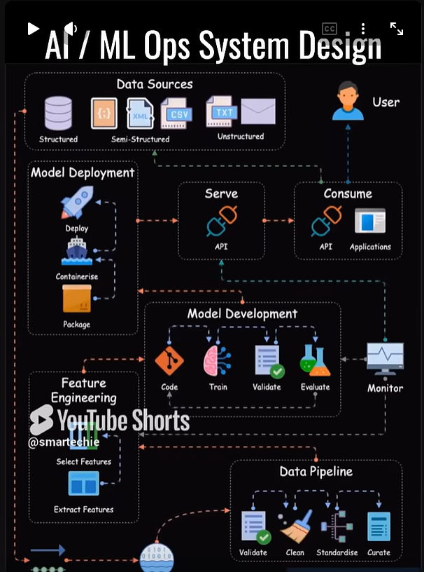

# ai-testing-lab

Laboratorio personal, 100% local y sin costo, para probar modelos de IA,
prompts, agentes/skills y pipelines RAG — con evaluación automatizada
(calidad, RAG, seguridad) y observabilidad de trazas. Diseñado para
escalar después a un despliegue multi-cloud portable (DigitalOcean, AWS,
Azure) sin rediseñar la arquitectura base.

> Ver `docs/architecture.md` para la clasificación completa de los
> repositorios open source analizados como referencia, el stack elegido y
> las decisiones de diseño. Ver `docs/diagram.md` para el diagrama del
> sistema.

## Inspiración visual



Esta imagen ("AI / ML Ops System Design") se usó **únicamente como
referencia de estilo visual** (fondo oscuro, tarjetas redondeadas
agrupando componentes, flechas de flujo con colores) para diseñar la
infografía propia del laboratorio. **No representa la arquitectura de
`ai-testing-lab`** — es un diagrama genérico de MLOps de terceros, sin
relación con este proyecto. La arquitectura real, con sus propios bloques
y flujo, está en `docs/diagram.md` ("AI Testing Lab Architecture").

## Qué incluye la Fase 1 (local, implementada en este repo)

- **Model serving**: Ollama, con interfaz compatible con OpenAI.
- **API gateway propia** (FastAPI) que expone agentes/skills y RAG.
- **Agentes/skills**: runtime propio y minimalista con 2 skills de ejemplo
  (`summarizer`, `rag_qa`).
- **RAG mínimo**: ingesta + índice + retriever, sin vector DB dedicada.
- **Testing de prompts**: promptfoo (prompt-level y end-to-end vía API).
- **Testing de la app LLM**: DeepEval, con juez 100% local.
- **Evaluación de RAG**: Ragas, con LLM/embeddings 100% locales.
- **Seguridad / red teaming**: promptfoo redteam + garak (documentado) +
  ModelScan (documentado, uso bajo demanda).
- **Observabilidad**: Arize Phoenix (trazas OTLP de cada llamada al modelo).
- **UI Streamlit local** (`ailab-ui`, puerto 8501): cliente HTTP del Gateway.
  Páginas operativas: **Inicio**, **Chat** (UI-1B) y **Skills** (UI-1C).
  El resto son placeholders (RAG…Arquitectura).
- **Scripts de automatización** para levantar, probar y validar todo.

## Requisitos

- Docker + Docker Compose v2.
- Node.js 18+ (opcional, solo para `promptfoo`).
- Python 3.11+ (opcional, solo para `DeepEval`/`Ragas`, cada uno con su
  propio virtualenv gestionado por los scripts).
- ~4-8 GB de RAM libres para correr un modelo pequeño local con margen.

## Quickstart

```bash
git clone <este-repo> ai-testing-lab   # o usa la carpeta ya generada
cd ai-testing-lab

./scripts/bootstrap.sh   # crea .env desde .env.example, valida dependencias
./scripts/up.sh          # levanta ollama + api + phoenix + ui, descarga modelos
./scripts/health_check.sh

# UI Streamlit (cliente del Gateway)
# http://127.0.0.1:8501
# OpenAPI: http://127.0.0.1:8080/docs
# Phoenix: http://127.0.0.1:6006

# Indexa los documentos de ejemplo para RAG
curl -X POST http://localhost:8080/rag/ingest

# Prueba un skill de agente
curl -X POST http://localhost:8080/agents/summarizer/run \
  -H "Content-Type: application/json" \
  -d '{"payload": {"text": "El laboratorio corre en local con Docker Compose.", "max_sentences": 1}}'

curl -X POST http://localhost:8080/agents/rag_qa/run \
  -H "Content-Type: application/json" \
  -d '{"payload": {"question": "¿Con qué se debe escanear un modelo de terceros?"}}'
```

Abre http://localhost:6006 para ver las trazas en Arize Phoenix.
Abre http://127.0.0.1:8501 para la interfaz Streamlit (estado del laboratorio).

## Interfaz Streamlit (UI-1A)

La UI **no accede directamente a Ollama, RAG, evaluaciones ni reportes**.
Todas las operaciones pasan por el **FastAPI Gateway**.

```text
Navegador → Streamlit (ailab-ui:8501) → FastAPI (ailab-api:8080)
                                         → Ollama / skills / RAG / evals / reports / Phoenix
```

| Variable | Uso |
|---|---|
| `AILAB_API_BASE_URL` | URL interna que usa Streamlit para HTTP (en Compose: `http://api:8080`) |
| `AILAB_API_PUBLIC_URL` | Enlace para el navegador (`http://127.0.0.1:8080`) |
| `AILAB_OPENAPI_DOCS_URL` | Enlace a `/docs` |
| `AILAB_PHOENIX_PUBLIC_URL` | Enlace a Phoenix en el host |
| `UI_PORT` | Puerto publicado en loopback (default `8501`) |

```bash
docker compose build ui
docker compose up -d
# UI:      http://127.0.0.1:8501
# API:     http://127.0.0.1:8080
# OpenAPI: http://127.0.0.1:8080/docs
# Phoenix: http://127.0.0.1:6006
```

**Limitaciones actuales:** Inicio, Chat (UI-1B) y Skills (UI-1C) están operativos.
RAG, Evaluaciones, Reportes, Observabilidad y Arquitectura siguen como
placeholders (UI-1D…UI-1G).

### Módulo Chat (UI-1B)

- Propósito: conversar con modelos locales vía `POST /chat`.
- Arquitectura: Streamlit → FastAPI Gateway → `LLMClient` → Ollama (Phoenix recibe trazas del Gateway).
- Controles: modelo (`GET /models` · solo `chat_models`), system prompt, temperature (0–1.5), max tokens (1–2048), limpiar conversación.
- Historial: únicamente en `st.session_state` (sobrevive a reruns; **se pierde** al cerrar el navegador o reiniciar `ailab-ui`). Sin base de datos.
- System prompt: no se muestra en el hilo; se envía como `role=system` en la siguiente solicitud; no elimina el historial.
- Metadata de respuesta: modelo, duración y `trace_id` (o «no disponible»).
- Errores: mensajes sanitizados (Gateway caído, Ollama 503, modelo inexistente, límites, JSON inválido).
- Sin streaming, sin autenticación, sin conexión directa a Ollama/Phoenix, sin truncado silencioso del historial.

### Módulo Skills (UI-1C)

- Propósito: ejecutar skills del Agent Runtime vía Gateway.
- Arquitectura: Streamlit → `GET /skills` / `POST /agents/{skill}/run` → Agent Runtime → skill → LLM o RAG.
- Skills soportadas en UI: `summarizer` (`text`, `max_sentences`) y `rag_qa` (`question`, `top_k`).
- Formularios tipados (sin editor JSON libre ni payloads arbitrarios).
- Historial de ejecuciones solo en `st.session_state` (máx. 20; se pierde al cerrar sesión/contenedor).
- Limpiar historial de Skills **no** afecta Chat ni otras páginas.
- `rag_qa` depende del índice RAG existente; la administración/ingesta queda para UI-1D.
- Sin ejecución directa de skills en Streamlit, sin imports del backend, sin conexión a Ollama.

Limitaciones del Gateway: Promptfoo/garak no están en la imagen API; jobs de eval
in-memory; `trace_id` puede ser `null`; la suite `security` no siempre
persiste reportes. El modelo pequeño local puede tener calidad limitada.

## Correr las suites de evaluación

```bash
./scripts/run_prompt_tests.sh     # promptfoo
./scripts/run_deepeval.sh         # DeepEval
./scripts/run_ragas.sh            # Ragas
./scripts/run_security_checks.sh  # red teaming (garak + promptfoo redteam, best-effort)

# o las 4 en secuencia, con resumen consolidado en reports/<fecha>/<hora>/summary.md
./scripts/run_all_evals.sh
```

Ver `docs/testing-playbook.md` para cuándo usar cada una y cómo interpretar
los resultados.

## Estructura del repositorio

```
ai-testing-lab/
├── docker-compose.yml       # ollama + api + phoenix + ui
├── .env.example
├── LICENSE                  # MIT (código original de este repo)
├── ATTRIBUTIONS.md          # licencias de todas las dependencias de terceros
├── app/                     # aplicación propia (Gateway)
│   ├── api/                 # gateway FastAPI (punto único de entrada)
│   ├── agents/               # runtime de agentes + skills reutilizables
│   ├── prompts/              # plantillas de prompt versionadas
│   ├── rag/                  # ingesta + retriever + documentos de ejemplo
│   ├── core/                  # config, cliente LLM, tracing
│   └── config/                # configuración declarativa de referencia
├── ui/                      # Streamlit (cliente HTTP del Gateway, UI-1A)
│   ├── app.py
│   ├── api_client.py
│   ├── views/                 # vistas (NO pages/: evita nav automática de Streamlit)
│   └── Dockerfile
├── evals/                   # todo lo relacionado a evaluación
│   ├── promptfoo/             # testing de prompts
│   ├── deepeval/              # testing de la app LLM
│   ├── ragas/                 # evaluación de RAG
│   └── security/               # red teaming (garak, promptfoo redteam) + ModelScan
├── observability/
│   └── phoenix/                # cómo ver trazas, por qué Phoenix y no Langfuse
├── scripts/                 # automatización (levantar, probar, validar)
│   └── lib/                    # helpers compartidos (ej. detección de Python)
├── reports/                  # resultados de evaluación, organizados por fecha/hora
├── docs/                    # arquitectura, playbook, seguridad, Fase 2, diagrama
└── infra/future/             # diseño de Fase 2 (DigitalOcean, AWS, Azure) — solo diseño
```

## Documentación

- `docs/architecture.md` — clasificación de repos de referencia, stack
  elegido, arquitectura, decisiones y trade-offs, qué es MVP vs Fase 2.
- `docs/testing-playbook.md` — cómo y cuándo usar cada capa de testing.
- `docs/security-notes.md` — riesgos de terceros, datos sensibles,
  licencias, qué es original vs. de terceros.
- `docs/phase-2-multicloud.md` — diseño del roadmap multi-cloud (2A/2B/2C).
- `docs/diagram.md` — diagrama Mermaid del sistema + explicación + layout
  visual sugerido para convertirlo en infografía.

## Qué es MVP, qué es opcional, qué es Fase 2

Ver la sección 5 de `docs/architecture.md` para el detalle completo. En
resumen: todo lo listado arriba en "Qué incluye la Fase 1" es MVP
funcional; LocalAI y garak como CLI quedan documentados como opcionales;
el despliegue a nube, Kubernetes, LangGraph/CrewAI, Langfuse/Opik/MLflow y
llm-guard quedan diseñados para la Fase 2.

## Notas importantes

- Este repo no depende de ningún servicio de nube pago en la Fase 1.
- No incluyas datos sensibles reales en `app/rag/sample_docs/` ni en
  ningún dataset de prueba — ver `docs/security-notes.md`.
- Antes de correr herramientas de red teaming (garak, promptfoo redteam),
  lee las advertencias en `evals/security/garak/README.md` y
  `scripts/run_security_checks.sh`.
