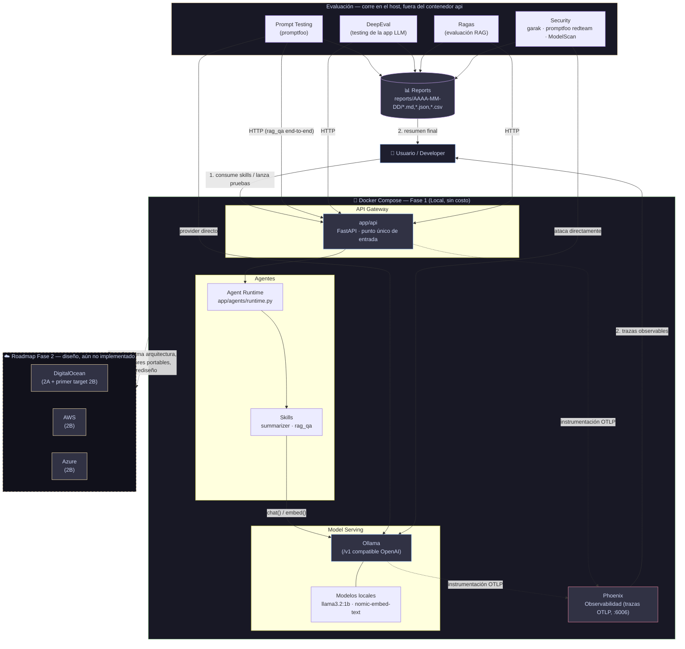

# AI Testing Lab Architecture — diagrama del sistema

> **Sobre la inspiración visual**: la composición (fondo oscuro, tarjetas
> redondeadas agrupando componentes, flechas de flujo con color) se
> inspira en el estilo del diagrama de referencia `docs/assets/inspiration-ai-ml-ops.png`
> ("AI / ML Ops System Design", de terceros, insertado también en el
> `README.md`). **No se copió su arquitectura**: ese diagrama describe un
> pipeline genérico de MLOps (Data Sources → Feature Engineering → Model
> Development → Deployment → Serve/Consume) que no corresponde a
> `ai-testing-lab`. Lo que sigue es un diagrama propio que representa la
> arquitectura real de este proyecto, con sus propios bloques y flujo.

## 1. Diagrama Mermaid — arquitectura real del proyecto

> Renderiza este bloque en GitHub/GitLab, VS Code (extensión "Markdown
> Preview Mermaid Support"), Obsidian, o pega el código en
> https://mermaid.live para exportarlo como PNG/SVG.

## 2. Bloques del diagrama (los 15 pedidos, mapeados 1:1 al proyecto real)

| Bloque pedido | Dónde vive en el repo | Qué representa |
|---|---|---|
| Usuario | — | Persona que lanza pruebas/consultas (scripts, curl, promptfoo CLI). |
| Docker Compose | `docker-compose.yml` | Orquesta `ollama`, `api`, `phoenix` en una sola red local. |
| API Gateway | `app/api/main.py` | Único punto de entrada HTTP del laboratorio. |
| Ollama | servicio `ollama` | Motor de inferencia, interfaz nativa + compatible OpenAI (`/v1`). |
| Modelos locales | volumen `ollama_data` | `llama3.2:1b` (chat) y `nomic-embed-text` (embeddings). |
| Skills | `app/agents/skills/` | Unidades de capacidad tipadas (`summarizer`, `rag_qa`). |
| Agentes | `app/agents/runtime.py` | Registro y ejecución de skills por nombre. |
| Prompt Testing | `evals/promptfoo/` | Pruebas de prompt-level y end-to-end vía promptfoo. |
| DeepEval | `evals/deepeval/` | Testing de la app LLM completa, juez 100% local. |
| Ragas | `evals/ragas/` | Evaluación del pipeline RAG (faithfulness, relevancy, etc.). |
| Security | `evals/security/` | garak, promptfoo redteam, ModelScan. |
| Phoenix | servicio `phoenix` | Observabilidad: trazas OTLP de cada llamada al modelo. |
| Reports | `reports/` | Resultados de cada corrida de las suites, organizados por fecha. |
| Roadmap → DigitalOcean | `infra/future/digitalocean/` | Primer destino de despliegue (Fase 2A/2B). |
| Roadmap → AWS | `infra/future/aws/` | Segundo destino posible (Fase 2B). |
| Roadmap → Azure | `infra/future/azure/` | Tercer destino posible (Fase 2B). |

## 3. Explicación del flujo

1. El usuario lanza una prueba o consulta (`curl`, un script de `scripts/`,
   o la CLI de promptfoo).
2. Si es una consulta de uso normal, llega a la **API Gateway**, que
   delega en el **Agent Runtime** y este ejecuta el **skill**
   correspondiente.
3. El skill llama a **Ollama** (chat o embeddings) usando los **modelos
   locales** descargados.
4. Cada llamada al modelo queda instrumentada y se envía como traza OTLP a
   **Phoenix**, visible en `http://localhost:6006`.
5. Los módulos de **evaluación** (Prompt Testing, DeepEval, Ragas,
   Security) corren *fuera* del contenedor de la API — contra el gateway
   HTTP o contra Ollama directo, según el caso — y escriben sus resultados
   en **Reports**.
6. El usuario revisa trazas en Phoenix y el resumen consolidado en
   `reports/`.
7. La rama punteada hacia **DigitalOcean / AWS / Azure** representa que la
   Fase 2 es una *extensión* de esta misma arquitectura (mismos
   contenedores, otro orquestador/red/almacenamiento), no un rediseño —
   ver `docs/phase-2-multicloud.md`.

## 4. Propuesta de layout para una futura infografía SVG/PNG

Diseño original (no es una copia de `docs/assets/inspiration-ai-ml-ops.png`;
solo toma prestada la paleta y el lenguaje visual de tarjetas oscuras +
flechas de flujo con color):

- **Fondo**: gris casi negro (`#11111b` → `#181825`), tema oscuro tipo
  terminal — igual criterio que la referencia, aplicado a bloques propios.
- **Título superior**: "AI TESTING LAB ARCHITECTURE" en mayúsculas, blanco,
  tipografía bold sans-serif, con un subtítulo pequeño "Fase 1 · Local ·
  Sin costo" debajo, en gris claro.
- **Fila 1 (arriba)**: ícono de "Usuario" a la izquierda; a la derecha,
  alineado, el bloque punteado "Roadmap Fase 2" con 3 sub-tarjetas
  pequeñas en línea: DigitalOcean / AWS / Azure (con sus logos oficiales),
  unidas por una sola flecha punteada amarilla que sale del bloque
  central.
- **Bloque central grande, con borde sólido verde** ("Docker Compose —
  Fase 1"), dividido internamente en un grid de 4 tarjetas:
  1. **API Gateway** (ícono de enchufe/API, azul).
  2. **Model Serving** (ícono de cohete/base de datos, azul) con dos
     sub-íconos debajo: "Ollama" y "Modelos locales".
  3. **Agentes** (ícono de engranaje/cerebro, morado) con dos sub-íconos:
     "Agent Runtime" y "Skills".
  4. **Phoenix / Observabilidad** (ícono de gráfico/ojo, rosa).
- **Fila inferior, fuera del bloque Docker (con borde amarillo, indicando
  "corre en el host")**: 4 tarjetas en línea — Prompt Testing, DeepEval,
  Ragas, Security — cada una con su ícono representativo (matraz/probeta
  para evals, escudo para seguridad).
- **Tarjeta "Reports"** debajo de la fila de evaluación, con ícono de
  gráfico de barras/documento, en morado, recibiendo una flecha desde cada
  una de las 4 tarjetas de evaluación.
- **Flechas**: sólidas azules para el flujo de datos activo (Usuario → API
  → Agentes → Ollama), punteadas rosas/moradas para instrumentación hacia
  Phoenix, punteadas moradas hacia Reports, y punteada amarilla hacia el
  Roadmap de nube (mensaje visual: "extensión futura", no producción hoy).
- **Tipografía**: monospace para nombres técnicos (Ollama, FastAPI,
  promptfoo, DeepEval, Ragas, Phoenix), sans-serif para etiquetas de flujo
  y descripciones cortas.
- **Íconos**: oficiales de cada tecnología si se produce en Figma/Canva
  (Docker, Ollama, FastAPI, DigitalOcean, AWS, Azure); iconografía genérica
  (engranaje, matraz, escudo, gráfico de barras) para los conceptos propios
  del laboratorio (Skills, Agentes, Security, Reports).

Esta descripción es suficientemente detallada para pasarla directo a una
herramienta de diseño (Figma, Canva) o a un generador de imágenes,
manteniendo la estructura lógica del diagrama Mermaid de la sección 1.
